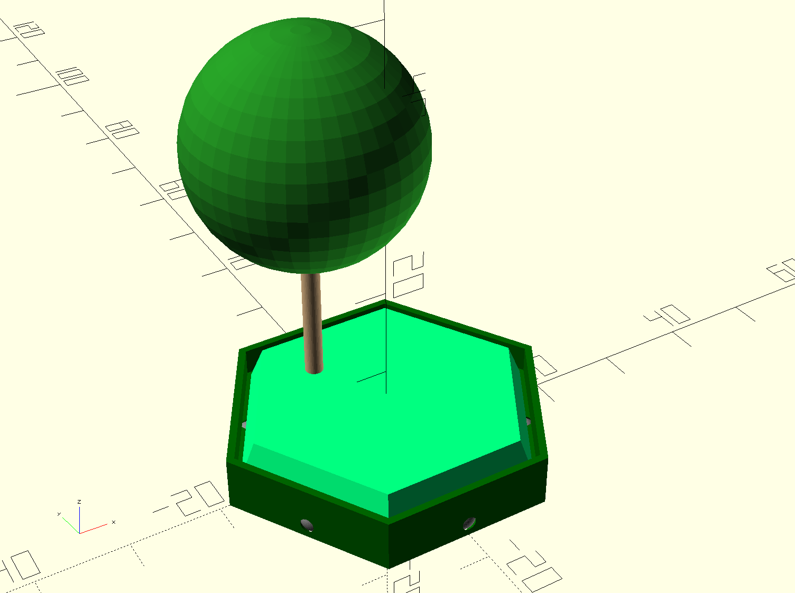

# Hexforest

A small OpenSCAD project of modular hexagonal forest terrain for the Battletech tabletop game.
Size of the hexes is assumed to be 32.75mm between edges.
It currently looks something like this:

